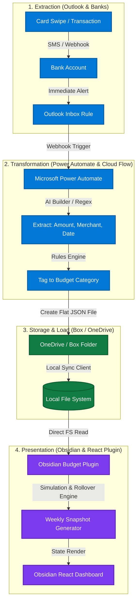

# FinFlow-Hybrid: Event-Driven Personal Finance Pipeline

Welcome to **FinFlow-Hybrid** (GitHub: *Budget Tracker Automation*), an enterprise-grade, event-driven ETL (Extract, Transform, Load) pipeline designed to automate personal expense tracking and wealth simulation. 

Rather than relying on closed-source, subscription-based budgeting apps, this system serves as a functional software engineering sandbox. It integrates enterprise cloud services (Microsoft Outlook, Power Automate, OneDrive/Box) with local, privacy-first tools (Obsidian, React) to create a custom-tailored personal finance engine.

---

## 🎨 Architectural Overview

Below is the event-driven data flow, representing a complete decoupling of transaction extraction, data processing, and client presentation:



---

## 💡 The Philosophy: Why Sync These Components?

Traditional budgeting applications (like Copilot, Monarch, or Mint) suffer from three fatal flaws: they are **closed-source**, **rigid in their budgeting rules**, and **charge recurring subscription fees**. 

**FinFlow-Hybrid** was built to prove that you can achieve a seamless, automatic, and highly visual budgeting pipeline by orchestrating services you already use. It was designed around several key architectural decisions:

1. **Email-Driven Extraction vs. Plaid APIs:**
   Standard banking aggregators (like Plaid) require sharing bank login credentials, frequently break multi-factor authentication, and are built as pull-based cron jobs. By utilizing **Outlook Inbox Rules** combined with **real-time transaction email alerts** from credit cards, our pipeline becomes entirely push-based (event-driven). The moment you swipe your card, the data starts flowing.
2. **Enterprise low-code Orchestration (Power Automate):**
   Instead of writing and maintaining a custom Python server to listen for webhooks and poll accounts, **Microsoft Power Automate** acts as a resilient, serverless integration layer. It catches new emails instantly, utilizes lightweight AI/Regex matching to parse the body, and writes files directly to the cloud.
3. **Box / OneDrive as the Synchronization Layer:**
   OneDrive and Box sync clients are highly optimized, native applications that bridge cloud workflows and local drives instantly. Dropping a `[Date]_[ID].json` file into Box from Power Automate causes it to appear in your local directory milliseconds later, without having to expose your local machine to the public internet via web servers.
4. **Local-First, Privacy-Centric Presentation (Obsidian & React):**
   Obsidian is a powerful, markdown-based personal knowledge vault. By writing a custom **React-based Obsidian Plugin**, your transaction ledger remains 100% yours—stored as simple flat JSON files on your disk. The custom plugin parses these files on-the-fly, executing complex chronological rollover calculations.
5. **Decoupled Simulation Engine (Azure Functions / Local JS):**
   To support advanced calculations, we maintain a standalone simulation engine. It runs locally inside the plugin’s `dataService.ts` and can easily be migrated to serverless **Azure Functions** down the road to handle heavier API routines, such as pulling investment performance.

---

## 📈 The Summer 2026 Strategy: "Simulated Independence"

The core math of the pipeline is built around the **Summer 2026: Simulated Independence** budget. It splits net income into distinct allocations while simulating a fixed housing environment:

* **Base Essentials ($180/week):** Food ($125), Gas ($40), Subscriptions ($15).
* **Experiences Fund ($130/week):** Covers dining out, raves/music events, soccer game gatherings, and spontaneous fun.
* **Strict Savings ($350/week):** Direct net wealth accumulation.
* **Simulated Housing Fund ($190/week):** Simulates an $820/month rent payment.

### Dynamic Housing Scenarios
The beauty of the simulation engine is that you behaviorally **always budget as if you are paying the full $190/week for rent**. The pipeline then dynamically routes the funds based on parent contributions without you having to re-adjust your daily math:

* **Scenario A (You Pay Rent In Full):** $190 goes to rent, $350 goes to savings. You accumulate **$3,500** in savings over 10 weeks.
* **Scenario B (Parents Pay Half Rent):** $95 goes to rent, and the remaining **$95 is automatically routed directly into your Savings Vault** as a *Rent Protection Reserve*. You accumulate **$4,450** in savings.
* **Scenario C (Parents Cover Rent in Full):** $0 goes to rent, and the entire **$190 is automatically swept into your Savings Vault**. You accumulate **$5,400** in savings.

---

## ⚙️ Core Technical Directories

This repository is organized into distinct, modular layers:

```
├── .agents/                    # Specialized AI agent system configurations
├── docs/                       # System Architecture & PRD documentation
│   ├── architecture/           # Deep-dives into ingestion strategies and formulas
│   └── workspace/              # Inbox, logs, and archival ledgers
├── obsidian-budget-plugin/     # The custom Obsidian client
│   ├── src/                    # React views, models, and simulation services
│   │   ├── BudgetDashboard.tsx # Premium UI dashboard
│   │   └── dataService.ts      # Chronological rollover simulation engine
│   └── styles.css              # Glassmorphic, modern dark-mode themes
├── scripts/                    # Automation utilities
│   └── git_automate.py         # Resilient deployment pipeline script
├── simulate_flow.py            # CLI-based scenario and transaction generator
└── budget_config.json          # Master config (allocations, rollover, splits)
```

---

## 🚀 Advanced Simulation & Rollover Engine

The pipeline implements advanced chronological rollover rules defined in `budget_config.json`:

```json
"rollover_rules": {
  "Experiences": {
    "rollover_percent": 50,
    "sweep_target": "Strict Savings",
    "sweep_percent": 50
  },
  "Gas": { "rollover_percent": 100 },
  "Groceries": { "rollover_percent": 100 }
}
```

* **Leftover Balances:** Surplus money rolls over to keep your budget fluid.
* **Rollover Sweeps:** The engine can execute multi-target splits (e.g., sweeping 50% of the remaining *Experiences* fund to *Strict Savings* and keeping 50% in the *Experiences* cushion).
* **Deficit Payback:** If you overspend on a category, the engine carries the deficit over as a **negative cushion** into the next week, forcing you to pay it back before you can build a surplus again.

---

## 🔮 Future Roadmap

* **Module 1: Savings Vault Engine:** Allocate the $350/week savings and swept surpluses into visual sub-vaults (Emergency Fund, World Cup Ticket, Stock Reserve) with automated split rules.
* **Module 2: Stock Portfolio Sandbox:** Add an investment ledger in `budget_config.json` that fetches live market prices from Yahoo Finance using Obsidian's native CORS-bypass `requestUrl` to calculate a true **Live Net Worth**.
* **Module 3: Timeline Gamification:** Add visual milestone badges (e.g., *"The Launchpad"*, *"World Cup Ready"*) and a week-by-week timeline of the summer.
