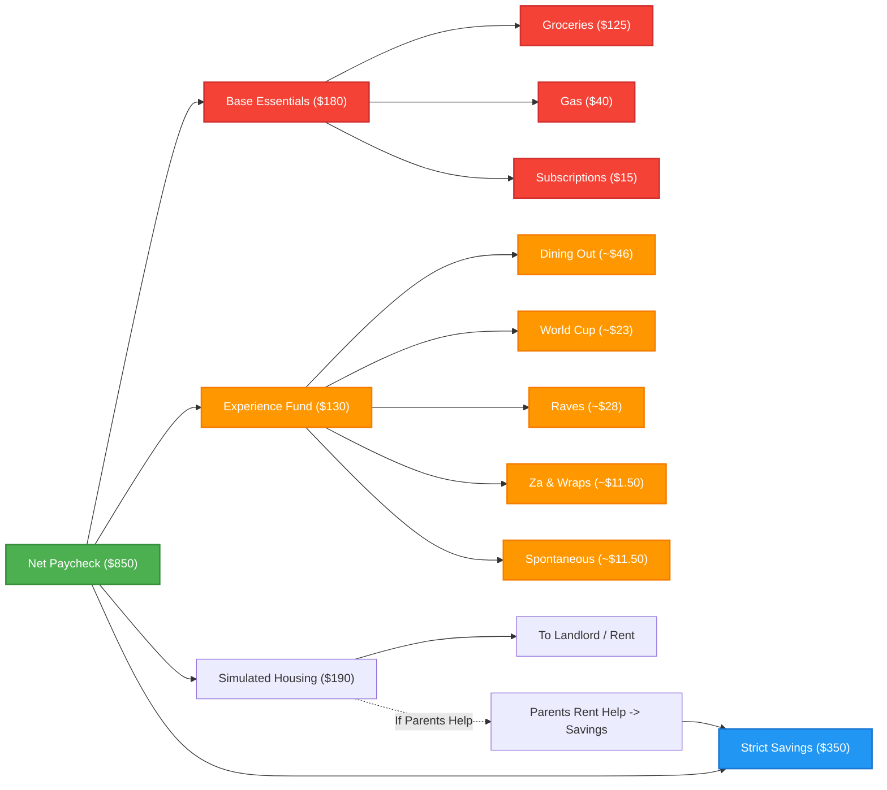
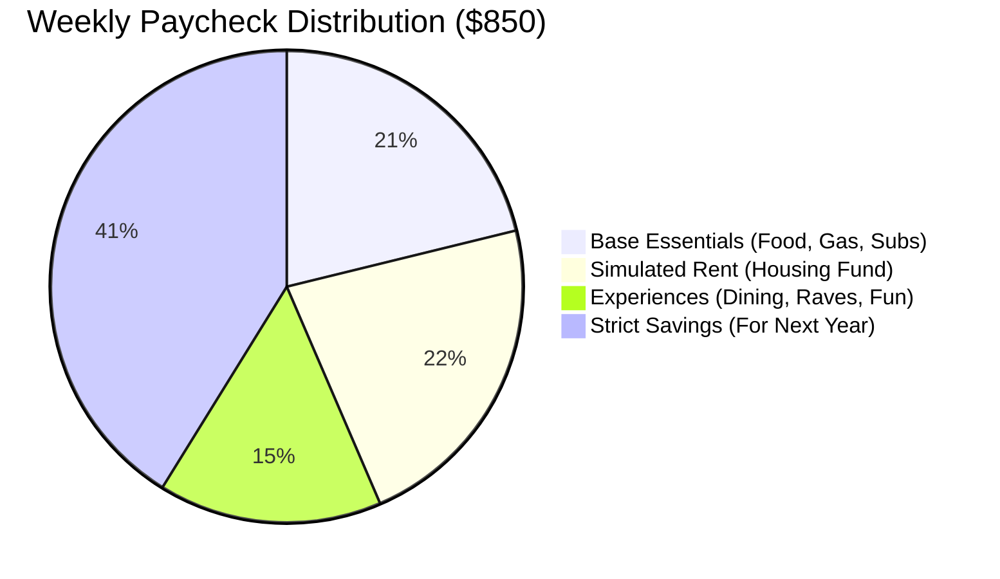
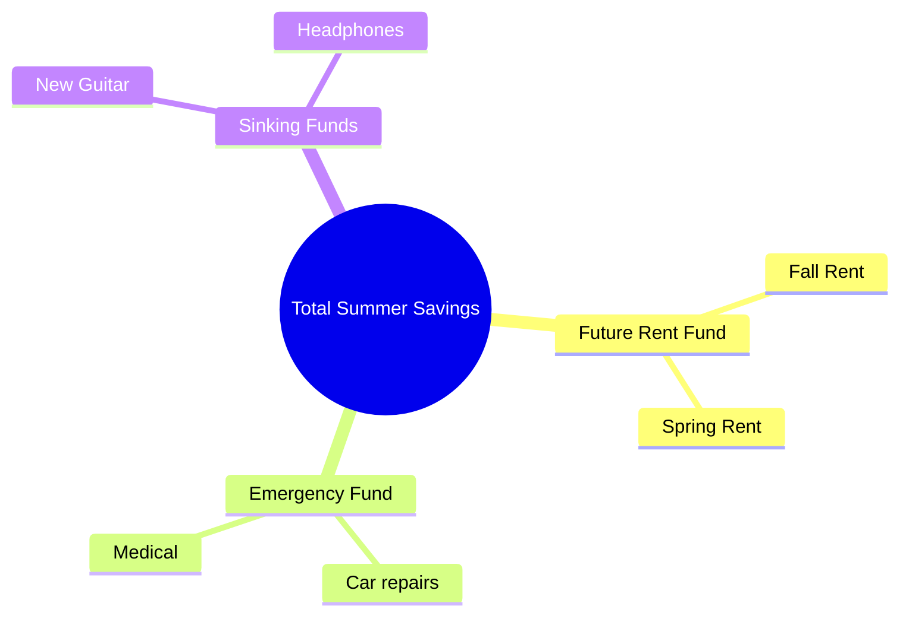

# Summer 2026 Budget Visualizations

Since you are a software engineer and are using Obsidian, you can use **Mermaid.js**, which is natively supported in Obsidian! It allows you to generate dynamic charts and diagrams strictly through code. 

Here are a few ways to visualize your "Simulated Independence" budget so you can track how your money flows without needing a spreadsheet.

## 1. The Income Flowchart (How Your Paycheck Splits)
This diagram maps exactly where a standard weekly paycheck of $850 goes. It makes it very easy to visualize how your Simulation works.

## 2. Overall Allocation Pie Chart
If you ever want a quick glance at your ratios to make sure you aren't overspending in one category, this pie chart breaks down your 100% distribution.

## 3. Your Summer Savings Trajectory
You can also use a Mindmap framework to break down exactly what that $350+ a week is building toward.

## How to Customize This Workflow Further
As a software engineer, you can take this further into an automated workflow:
1. **Obsidian Dataview Plugin:** You can use the Dataview plugin to treat your markdown notes like a database. If you add YAML frontmatter (like `Cost: 15` and `Category: Fun`) to your daily journal notes when you buy something, Dataview can write dynamic SQL-like queries inside Obsidian to instantly show you a table of your spending that week.
2. **Obsidian Tracker Plugin:** This plugin reads your daily notes and creates automated line graphs over time (e.g., watching your "Wants" spending go up or down week by week).
