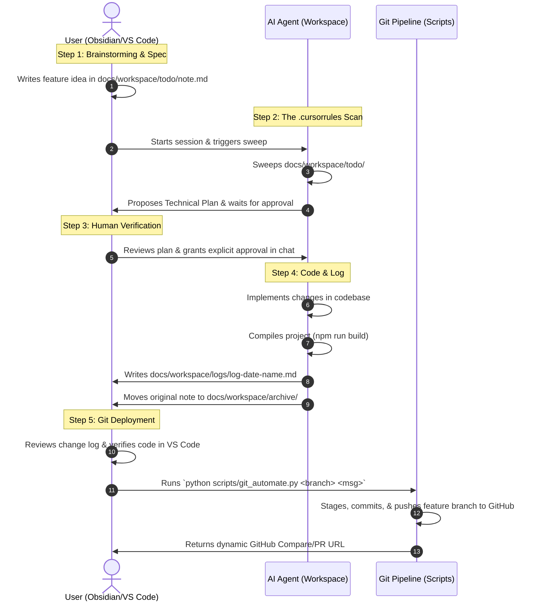

# Architecture: Human-Agent Workflow Loop

This document serves as the single source of truth explaining the bidirectional, transactional workflow established between the developer workspace, the Obsidian Personal Knowledge Management (PKM) vault, and the Git/GitHub deployment pipeline.

The core philosophy of this design is **separation of concerns** and **human-in-the-loop validation**. The human maintains high-level strategic and architectural control (via Obsidian and VS Code), while the AI agent functions as a high-fidelity implementation engine executing under a strict transactional protocol.

---

## Workflow Sequence

Below is the complete sequence showing how a feature transitions from a raw thought in Obsidian to a merged codebase pull request:

---

## Component A: The Obsidian Vault Directory (docs/workspace/)

The Vault workspace acts as the user interface for project management. It is split into three directories to maintain a clean "Inbox-to-Archive" flow:

| Folder | Owner | Role | Contents |
| :--- | :--- | :--- | :--- |
| `docs/workspace/todo/` | **Human** | **Inbox**: Active instruction triggers. | Raw markdown notes representing ideas, bugs, refactors, or feature requests. |
| `docs/workspace/logs/` | **Agent** | **History**: Chronological changes ledger. | Walkthrough documents detailing modified files, build results, and testing contexts. |
| `docs/workspace/archive/` | **Agent** | **History**: Archival storage. | User-written brainstorm notes relocated here after successful implementation. |

---

## Component B: The Rules Engine (.cursorrules)

The `.cursorrules` configuration file resides at the developer workspace root and is automatically parsed by the agent CLI at session boot. It acts as the agent's system prompt instructions to secure the transactional flow.

### The 4-Step Transaction Protocol:
1. **Scan and Detect**: Sweep `docs/workspace/todo/` for incoming files. If present, immediately stop and draft a comprehensive plan inside chat. **Never modify code before user approval.**
2. **Implement**: Perform the modifications, compile (`npm run build`), and verify the codebase is completely error-free.
3. **Log**: Document all changes file-by-file, along with build and verification terminal outputs, inside `docs/workspace/logs/log-YYYY-MM-DD-<name>.md`.
4. **Archive**: Move the original todo file from `todo/` to `archive/` to complete the transaction.

---

## Component C: Git Automation (scripts/git_automate.py)

Since you maintain final deployment authority, the agent **never** commits code to your remote repository. Instead, you run the Git automation workflow script once you are satisfied with the agent's work.

### Script Workflow:
The Python automation script (`scripts/git_automate.py`) standardizes and secures the version control process by executing these synchronous shell commands:

1. **Workspace Check**: Runs `git status --porcelain` to verify changes exist.
2. **Feature Branch Checkout**: Automatically creates and checks out the custom feature branch (e.g. `feat/expand-limits-ui` or `fix/path-resolution`). If the branch already exists locally, it checks it out directly.
3. **Stage and Commit**: Runs `git add .` and commits the changes using a **Conventional Commit** message format (e.g., `feat(plugin): implement limit dashboards`).
4. **Remote Push**: Pushes the feature branch to your GitHub repository and sets the upstream remote origin: `git push -u origin <branch_name>`.
5. **Dynamic PR URL Generation**: Extracts the remote repository URL, translates it into a standard HTTPS web URL, and appends `/compare/<branch_name>`.
6. **Output**: Prints a dynamic, clickable GitHub Pull Request link directly in your terminal console.

---

## Best Practices for Humans
*   **Drafting Notes**: Keep your inbox files inside `todo/` simple and direct. You can write in plain text, paste checklists, or dump raw thoughts—the agent is optimized to expand them into clean plans.
*   **Approval**: Always review the agent's plan in chat before typing "approved." This ensures you maintain architectural control over file placements and dependencies.
*   **Verification**: Check the generated walkthrough log inside `docs/workspace/logs/` after compilation. It will show you exactly what changed before you run the Git deploy command.
