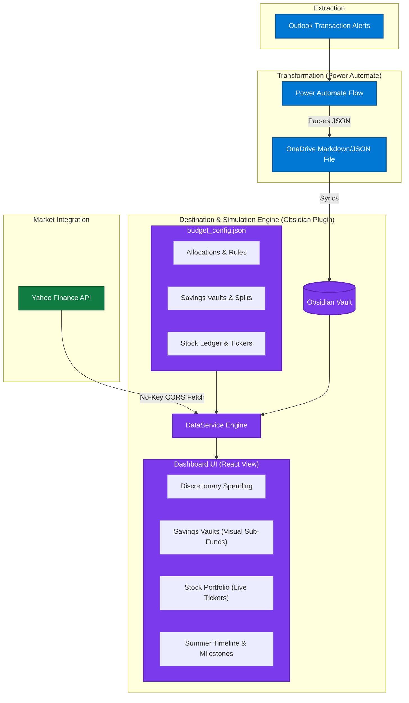

# Summer 2026 Budgeting: Savings, Stocks, & Gamification Strategy

This document proposes three high-impact, lightweight modules designed to elevate your personal finance system from a transaction-tracker to a comprehensive wealth-building machine tailored precisely for your **Summer 2026 Simulated Independence**.

---

## Architectural Concept Map

Below is the updated event-driven architecture, showing how savings vaults, automated sweeps, and real-time stock integrations plug into your existing workflow:



---

## Module 1: The "Savings Vault" Engine (Sub-Fund Tracking)

Currently, your budgeting system routes your weekly **$350.00 Strict Savings** allocation (plus any sweeps from **Experiences**) into a single, generic category. This module breaks down that large savings bucket into **intentional, visual sub-vaults** that track specific goals.

### How it Works in the Backend (budget_config.json)
We can expand your existing configuration file to define your savings vaults, targets, and split rules:

```json
{
  "initial_seed_balance": 1900.0,
  "allocations": {
    "Groceries": 125.0,
    "Gas": 40.0,
    "Subscriptions": 15.0,
    "Experiences": 130.0,
    "Strict Savings": 350.0
  },
  "savings_splits": {
    "Emergency Fund": 30,
    "World Cup 2026 Fund": 20,
    "Investment Reserve": 40,
    "Spontaneous Fun Savings": 10
  },
  "savings_vaults": {
    "Emergency Fund": { "target": 1000.0, "current": 300.0 },
    "World Cup 2026 Fund": { "target": 600.0, "current": 150.0 },
    "Investment Reserve": { "target": null, "current": 500.0 },
    "Spontaneous Fun Savings": { "target": null, "current": 100.0 },
    "Rent Protection Reserve": { "target": 1900.0, "current": 0.0 }
  }
}
```

### The Core Savings Rules

1. **Automated Split Rules:** When your weekly $350.00 is deposited, the simulation engine automatically slices it up into the sub-vaults based on your percentage splits (e.g., 30% to Emergency, 20% to World Cup, etc.).
2. **Surplus Rollover Sweep:** If your weekly discretionary buckets (like **Experiences** or **Groceries**) have a surplus, their sweep percentage (50% for Experiences) is redirected into the **Spontaneous Fun Savings** or **Investment Reserve** vault.
3. **The "Simulated Rent" Buffer (Scenario B & C):** 
   > [!IMPORTANT]
   > If your parents pay for 50% or 100% of your rent, the money you "saved" by not paying it (e.g., $95.00/week or $190.00/week) is routed **automatically** into a dedicated **"Rent Protection Reserve"** vault. 
   > This visually separates the rent money you *would* have spent from your spending money, ensuring your parents' help directly increases your liquid net worth.

### Visual Layout in the Dashboard
* **Dynamic Progress Bars:** Each vault gets a premium, glassmorphic progress bar displaying `Current / Target` with percentage badges.
* **Goal Status:** Vaults that hit their target automatically glow green with a small success badge (e.g., "Fully Funded").

---

## Module 2: The "Stock Portfolio Sandbox" (Lightweight Investment Tracker)

Adding investments shouldn't mean writing heavy brokerage integrations or introducing security risks. Instead, we can build a lightweight **Obsidian Investment Ledger** that automatically tracks your portfolio value using real-time market data.

### Real-Time Pricing (Zero API Keys Required!)
> [!TIP]
> Obsidian has a built-in API function called requestUrl which bypasses browser CORS (Cross-Origin Resource Sharing) restrictions. 
> We can leverage this to make direct, credential-free fetches to Yahoo Finance's public chart endpoint:
> https://query1.finance.yahoo.com/v8/finance/chart/{TICKER}
> This allows us to fetch live stock prices for your portfolio on-the-fly, entirely for free, without needing any developer tokens!

### How it Works in the Backend (budget_config.json)
We add a portfolio ledger representing your holdings:

```json
"portfolio": [
  { "ticker": "VOO", "shares": 3.5, "average_cost": 480.0 },
  { "ticker": "MSFT", "shares": 2.0, "average_cost": 415.0 },
  { "ticker": "AAPL", "shares": 5.0, "average_cost": 175.0 }
]
```

### The Portfolio Intelligence Engine
1. **Live Valuations:** The React component fetches current market prices when the dashboard loads.
2. **Performance Metrics:** The engine calculates:
   * **Current Value:** `Shares * Current Price`
   * **Total Cost Basis:** `Shares * Average Cost`
   * **All-Time Return:** `Current Value - Total Cost Basis` (displayed in green/red dollar amounts and percentages).
3. **Net Worth Fusion:** Your dashboard will now calculate a live **Total Net Worth** metric combining:
   $$\text{Total Net Worth} = \text{Liquid Cash Balance} + \text{Total Portfolio Value}$$

### Visual Layout in the Dashboard
* **Glassmorphic Portfolio Card:** A card that glows with a subtle mesh gradient displaying your overall investment balance and performance.
* **Allocation List:** A clean list of your stocks showing ticker, allocation percentage, shares, current price, and gain/loss.

---

## Module 3: "Summer Heatmap & Milestones" Gamification

Since this is a dedicated **Summer 2026 Budget**, we should gamify your 10-week timeline to keep you motivated and give you a dopamine hit for saving money!

### How it Works in the Backend
By establishing your summer start date and duration in `budget_config.json`, the simulation engine can determine your progress:

```json
"summer_timeline": {
  "start_date": "2026-05-18",
  "total_weeks": 10
}
```

### The Gamified Features

| Feature Name | Description | Visual Indicator |
| :--- | :--- | :--- |
| **Summer Progress Bar** | A visual timeline displaying the current week of your summer internship. | Progress bar: `Week 3 of 10` with a graduation cap icon. |
| **Savings Milestones** | Badge rewards that unlock automatically as your total net savings grow. | Grayed-out badges that light up when unlocked. |
| **The "Surplus Rescuer"** | Tracks the cumulative dollar amount of money you rescued from spending and swept to savings. | A glowing counter labeled: *"You successfully rescued $342.50 from discretionary spending!"* |

### Summer Milestone Badges to Unlock:
* **"The Launchpad"** (Unlocked at $1,000 Total Saved): You've established your foundation!
* **"World Cup Champion"** (Unlocked when World Cup sub-vault is 100% funded): Your tickets and beer funds are secured!
* **"Independence Builder"** (Unlocked at $3,500 Total Saved): Equivalent to Scenario A's baseline!
* **"Financial Sovereign"** (Unlocked at $5,000+ Total Saved): You fully conquered the summer!

---

## Summary Comparison: Effort vs. Impact

To help you decide what to focus on first, here is a quick breakdown:

| Module | Implementation Complexity | Daily Value / Dopamine | Primary Benefit |
| :--- | :--- | :--- | :--- |
| **1. Savings Vaults** | Medium (Updates to `dataService.ts` and React UI) | High | Gives every saved dollar a clear purpose and isolates parent-rent contributions. |
| **2. Stock Portfolio** | High (Needs Yahoo API requests + loading state handlings) | Very High | Provides a single dashboard for your entire net worth with real-time tracking. |
| **3. Gamification** | Low (Simple math based on dates & totals) | Medium | Keeps you motivated week-to-week through a defined 10-week summer roadmap. |

---

## Next Steps & Your Input

> [!NOTE]
> None of these additions require changes to your Power Automate pipeline! They all rely entirely on the simulation engine running inside your Obsidian plugin (`dataService.ts`) and your local dashboard UI (`BudgetDashboard.tsx`). 

Which of these features resonate with you the most? We can:
1. **Implement Module 1 (Savings Vaults & Splits)** to establish your concrete savings goals and handle "Simulated Rent" Scenario routing.
2. **Implement Module 2 (Stock Sandbox)** to pull in live tickers and display your investments.
3. **Implement Module 3 (Timeline & Milestones)** to quickly add the summer timeline and reward badges.
4. **Build a combination** of them! 

Let me know your thoughts, and we will sketch out the specific changes!
